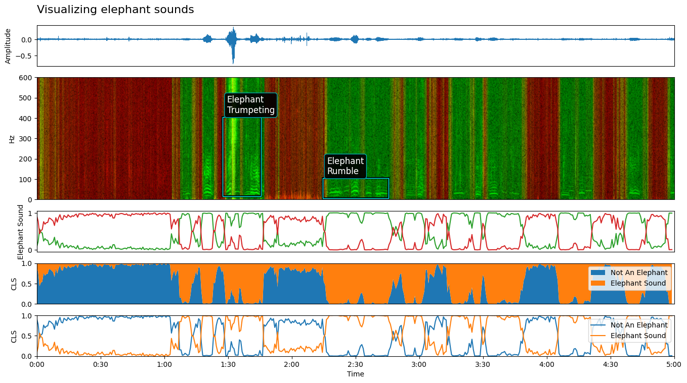

# audio-classifier-visualizer

A Python library for visualizing audio classifier outputs, including waveforms, spectrograms, and class probabilities over time.   Time-aligned visualization of waveforms, spectrograms, label annotations, and
classifier output — built for long (multi-hour to 24×7) audio recordings, with
efficient chunked/decimated CWT spectrograms and pluggable rendering.

This library was extracted from the [elephant-rumble-inference](https://github.com/ramayer/elephant-rumble-inference) project, which uses deep learning to detect and classify elephant rumble vocalizations in audio recordings.

## Example



## Install

```bash
pip install git+https://github.com/ramayer/audio-classifier-visualizer[all]
pip install audio-classifier-visualizer[all]        # STFT + wavelet + matplotlib
pip install audio-classifier-visualizer[stft,plot]  # STFT only, no ssqueezepy
pip install audio-classifier-visualizer[wavelet]     # just the CWT feature extractor, no plotting
```

The base install (`pip install audio-classifier-visualizer`) only depends on
`numpy` and `soundfile` — everything else (`librosa` for STFT, `ssqueezepy`
+`einx` for wavelets, `matplotlib` for rendering) is an extra, so you only pull
in what you actually use.

## Quick start

```python
from audio_classifier_visualizer import AudioVisualization, Track

viz = AudioVisualization(audio_file="recording.wav")
viz.show(start_time=3600, end_time=3720, tracks=(Track.WAVEFORM, Track.WAVELET_SPECTROGRAM))
```

With classifier output and labels:

```python
from audio_classifier_visualizer import AudioVisualization, ClassifierOutput, LabelBox, Track

classifier_output = ClassifierOutput(probabilities=probs, feature_rate=sr / 320, class_labels=["background", "elephant"])
labels = [LabelBox(start_time=12.0, end_time=14.5, low_freq=20, high_freq=250, text="rumble")]

viz = AudioVisualization(audio_file="recording.wav", classifier_output=classifier_output, labels=labels)
viz.show(
    start_time=0, end_time=60,
    tracks=(Track.WAVEFORM, Track.STFT_SPECTROGRAM, Track.CLASS_PROBABILITY_STACK),
    target_class="elephant",
)
```

For a file on disk, only the requested `[start_time, end_time)` range is ever
read and turned into features — a 24-hour recording never has to be loaded in
full just to look at one minute of it.

## Design

- **Core data model** (`AudioSignal`, `TimeAxis`, `LabelBox`, `ClassifierOutput`)
  is plain data with no I/O or plotting dependencies. Time is always seconds
  relative to a buffer's start; wall-clock/UTC display is derived from an
  optional `absolute_start` anchor on `TimeAxis`, not tracked as a second,
  independently-mutable value.
- **Feature extraction** (`features/stft.py`, `features/wavelet.py`,
  `features/colorize.py`) is array-in/array-out and independent of both I/O
  and rendering. The wavelet extractor's chunking + decimation strategy is
  what makes 24-hour-scale CWT/synchrosqueezed-CWT spectrograms tractable in
  memory; GPU use (`ssqueezepy` + `cupy`) is an explicit `use_gpu=True` flag.
- **I/O** (`io/audio_loader.py`, `io/labels_io.py`) is separate from
  visualization — loading is `soundfile`-based (handles arbitrary channel
  counts, including 6+1 surround, without the torchaudio→torchcodec churn),
  with an optional `librosa`-backed fallback for exotic formats.
- **Rendering is pluggable.** `VisualizationSpec` declaratively describes what
  to draw; any class implementing the `Renderer` protocol can draw it.
  `MatplotlibRenderer` (static images — the default, and a good fit for
  notebooks and batch reports) ships today. An interactive renderer
  (drag-zoom/pan/hover, e.g. Bokeh/HoloViews+Datashader) can be added later as
  a second implementation of the same protocol, with no changes to core/
  features/io.
- **`AudioVisualization`** is the notebook-facing facade tying loading,
  feature computation, and rendering together, with a small LRU cache over
  loaded slices so re-viewing a recently-seen time range is instant.

## Multichannel / surround sound

`AudioSignal.samples` is always `(n_channels, n_samples)`, even for mono, so
6+1 surround audio is not a special case — it's `n_channels == 7`. Feature
extraction currently operates on `as_mono()` (channel-averaged) by default;
true per-channel/multichannel spectrogram visualization (and verifying how
well `ssqueezepy`'s CWT batches across channels for GPU throughput) is
planned for a v1.1 release rather than blocking this rewrite.

## Upgrading from 0.x

Version 1.0.0 is a complete rewrite. If you have existing code depending on
the pre-1.0 API (`AudioFileVisualizer`, `visualize_audio_file_fragment`,
tuple-based label rows, etc.), pin the old version rather than upgrading in
place:

```bash
pip install "audio-classifier-visualizer==0.0.7"
```

Migration notes for moving to 1.0:

| 0.x | 1.0 |
|---|---|
| `AudioFileVisualizer(audio_file=..., start_time=..., end_time=...)` then `.visualize_audio_file_fragment(...)` | `AudioVisualization(audio_file=...)` then `.show(start_time=..., end_time=...)` |
| `class_probabilities` as a `torch.Tensor` | `ClassifierOutput(probabilities=np.ndarray, feature_rate=..., class_labels=...)` |
| Label rows as tuples (`row.bt, row.et, row.lf, row.hf, ..., row.notes`) | `LabelBox(start_time=, end_time=, low_freq=, high_freq=, text=)`, or `load_raven_selection_table(path)` |
| `Subplot` enum (`Subplot.WAVEFORM`, etc.) | `Track` enum, same idea, passed as `tracks=(...)` to `.show()` |
| Mono-only, `y: np.ndarray` shape `(n_samples,)` | `AudioSignal.samples` shape `(n_channels, n_samples)`; mono still works, pass a 1-D array and it's promoted automatically |
| `SSQ_GPU=1` environment variable for GPU wavelet transforms | `WaveletFeatureExtractor(use_gpu=True)` |
| One matplotlib-only implementation | `renderer=MatplotlibRenderer()` (default) or any future `Renderer` implementation |

There is no automatic data/API converter — the internal representations
changed too much (tensors → numpy, tuples → dataclasses, implicit UTC vs.
relative time → a single `TimeAxis`) for a mechanical translation to be
trustworthy. Treat 1.0 as a new library that happens to share a name and a
purpose.

## Development

```bash
pip install -e ".[dev]"
pytest
```
