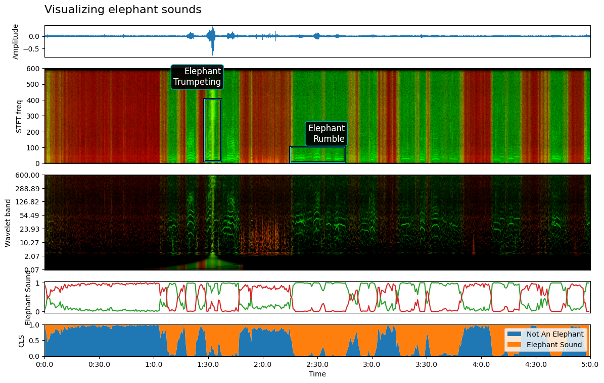

# Audio Classifier Visualizer

[](https://pypi.org/project/audio-classifier-visualizer)
[](https://pypi.org/project/audio-classifier-visualizer)

A Python library for visualizing audio classifier outputs, including waveforms, spectrograms, and class probabilities over time.

This library was extracted from the [elephant-rumble-inference](https://github.com/ramayer/elephant-rumble-inference) project, which uses deep learning to detect and classify elephant rumble vocalizations in audio recordings.


</img>

## Usage
```python

import audio_classifier_visualizer as acv

afv = acv.AudioFileVisualizer("audio_file.wav",
                              start_time=0, end_time=60*5, 
                              feature_rate=feature_rate, class_probabilities=probs, class_labels = class_labels)

plt = afv.visualize_audio_file_fragment(f"Title",  width=20, height=8)

plt.show()
```

[Demo notebook here](notebooks/demo.ipynb)

## Features

- Visualize audio waveforms
- Generate spectrograms with optional color overlays for classification results
- Plot class probabilities over time
- Highly configurable plotting options
- Support for both short and long audio files

## Installation

```console
pip install --quiet git+https://github.com/ramayer/audio-classifier-visualizer
```

## License

`audio-classifier-visualizer` is distributed under the terms of the [MIT](https://spdx.org/licenses/MIT.html) license.

## TODO 

* reduce dependencies, perhaps using torchaudio for more [torchaudio.transforms.Resample(sr, self.sample_rate)(waveform)]

